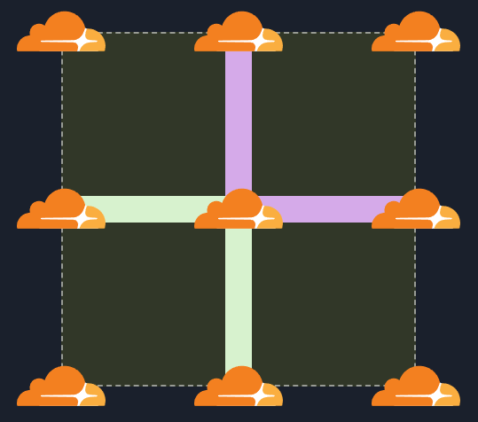

<a href="docs/images/logo.png"></a>

# Clouds And Edges

A Serverless & Databaseless Event-Sourced game powered by Cloudflare's Workers and Durable Objects.

This is a proof of concept projected created to test the feasibility of building an Event-Sourced system purely on Cloudflare Workers and Durable Objects.

To properly explore the space I implemented a simple multiplayer game based on the popular [Dots and Boxes](https://en.wikipedia.org/wiki/Dots_and_Boxes) which I call "Clouds & Edges".

There is a small Miro whiteboard here that highlights some of the important parts: https://miro.com/app/board/o9J_lq_d2nE=/

## What it looks like

[INSERT VIDEO LINK HERE]

You can play this over at: [INSERT LINK HERE]

## Packages

At the top level the project is divided into a number of packages that use [yarn workspaces](https://classic.yarnpkg.com/lang/en/docs/workspaces/) and [lerna](https://github.com/lerna/lerna).

- **essentials** - contains some basic utilities that can be shared with all packages
- **shared** - contains the the shared API and model that the site and server depend on
- **server** - contains the server-side part of the system that run on Cloudflare
- **site** - react application that runs in the browser
- **site-worker** - hosts the site on Cloudflare
- **workers-es** - contains project agnostic "Workers Event-Sourcing" code. This could potentially be turned into a public repo and published to npm.

See this part of the miro document for an overview of how all these parts fit together: https://miro.com/app/board/o9J_lq_d2nE=/

## Running it yourself

If you would like to run a copy of this locally yourself then you can, first clone the project and install the dependencies:

```
yarn install
```

Due to the way the mono-repo is structured for optimal IDE performance you must have TSC compiling in the background at all times:

```
yarn dev
```

Then in another terminal you can start the server running:

```
yarn server dev
```

In a third terminal window you can have the site running:

```
yarn site dev
```

There are a bunch of other commands you an run such as storybook or tests. See the "scripts" in the relevant `package.json` for whats available.

## Caveats

This project is very much a Proof of Concept. It works but there are a great many known (and likely unknown) issues.

For interested readers im going to detail the biggest points below.

### Async and Cloudflare Workers

- can things run in the background?

### Limited Queries

Because all data is stored in the DurableObjectStorage its conceptually easy to understand and the limited [Storage API](https://developers.cloudflare.com/workers/runtime-apis/durable-objects#transactional-storage-api) adds about some interesting challenges.

For example the EventStore cannot be queried for events related to only one aggregate, instead you must return ALL events (in batches) then filter them for the aggregates you want.

Another example is the Matches projection is rather limited and currently a little "hacky" because the storage and querying of matches is limited to just a single prefix string.

I think a future version of this project might have to look into using a third party database service such as [Fauna](https://fauna.com/).

### Sync Async

In a typical Event-Sourced system the various parts (Aggregates, Event Store, Read Models) are all separated by buffers and queues. This means that each part is distinct and independent from each other.

Well this is not really the way it works with Cloudflare DurableObjects. One object calls another object then must "await" its return before it can return to the client.

This is problematic as a command on an aggregate can cause a whole cascade of things to happen such as events adding to the store triggering processes which trigger yet more commands to be executed. During this whole process the initial command must wait for all this to happen before returning to the user.

This is particularly problematic when "rebuilding" a read model. Because the store could have millions / billions or more events in it, a "rebuild" could potentially take a very long time. Thus the caller or the rebuild might stall in the meantime.

This is something that would need to be looked at in a future version. Perhaps some external queuing service such as Kafka could be brought in to help.

### Proper Authentication

Currently the "auth token" is simply your user ID. This means that in theory anyone could execute API calls on behalf of any other user so long as you know their ID. Given more time it would fairly simple to implement some sort of simple auth such as JWT.

### Authorization

Hand in hand with Authentication comes Authorization. Currently there is no permissions or roles for users. Given more time it would be nice to give users roles particularly for "System Users" so that a distinction in user ability can be made.

### API Input Validation

Its obviously a good idea for a server to validate a user's input rather than blindly trusting it..well this project does none of that. It would be a simple matter of using [Zod](https://github.com/colinhacks/zod) or [io-ts](https://github.com/gcanti/io-ts) to ensure the input types at runtime match what you expect at compile time.

## Edge Cases

My past experience building a Serverless Event-Sourced solution at [Bamboo](https://www.getbamboo.io/) taught me that the devil is in the details with Event-Sourcing. There are a number of "gotchas" and edge-cases that you need to think about.

This project is functional however I know it likely has some nasty out-of-order bugs and edge cases that need to be properly thought out and tests cases written for.

Some quick edge-cases that would need to be considered:

- Ensure that when building / rebuilding read-models events are correctly buffered and played in the correct order
- Proper error handling and rollback of transactions if things go wrong

## More Testing

Unit tests are embarrassingly sparse in this project unfortunately. I am usually a big fan of automated testing and often use TDD. Unfortunately however when you are kind of exploring your problem space by simply coding it things get added, deleted and moved around all the time. Doing thorough testing during that process just slows things down and makes the architecture too rigid too early.

Anyways, given more time I would most definitely be adding many more tests of various sorts (unit, integration, e2e) to ensure that all the various edge cases are handled.

## Aggregate Rebuilding

Currently there is no way to "rebuild" an aggregate. Its state is fixed and cached in the DO and its storage. This is probably something that I would want to improve in the future.

## Resolve

[Resolve](https://github.com/reimagined/resolve) from DevExpress is an excellent Event-Sourcing libray in development that this project took a bunch of inspiration from. I originally intended to port it over directly to Cloudflare and Durable objects but there were issues with a few things so in the end I decided to roll my own.

If I was to do a future version of this project I would look harder at making it compatible as they have solved many of the issues above already.

## Inspiration

I have been a fan of Event Sourcing for some time now and have even built a Serverless Event-Sourced system on AWS when I was working at [Bamboo](https://www.getbamboo.io/). At the time there was virtually nothing on the topic so we struggled through all the various edge cases to build the working system.

Now however there are a few good examples, one I have been watching for some time now is [Resolve](https://github.com/reimagined/resolve) from DevExpress. They are a much more competent at event
